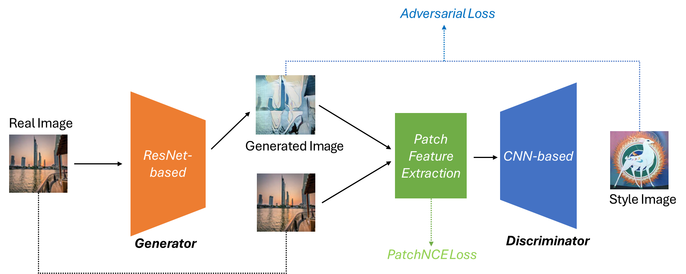
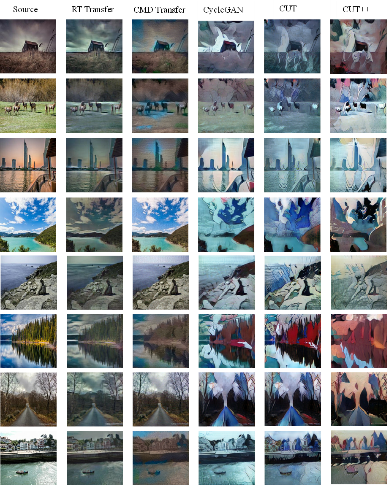

# CUT++: Unpaired Video-to-Image Translation

> [Pengxiang Zhu](https://jubsteven.github.io/), [Runze Guo](https://github.com/Alanze) , [Shengyang Zhou](https://github.com/Arrebol-logos)

This repository contains the code and report for the project of AI3603 (Theory and Applications of Artificial Intelligence). We build our model for image style transfer on the renowned [CUT](https://github.com/taesungp/contrastive-unpaired-translation) model.




### Prerequisites
- Linux or macOS
- Python 3
- CPU or NVIDIA GPU + CUDA CuDNN

### Getting started

Install PyTorch 1.1 and other dependencies (e.g., torchvision, visdsom, dominate, gputil).

  For pip users, please type the command `pip install -r requirements.txt`.

  For Conda users,  you can create a new Conda environment using `conda env create -f environment.yml`.

### CUT++ Training and Test

The dataset is unzipped at `./datasets/jsl/`.

- To view training results and loss plots, run `python -m visdom.server` and click the URL http://localhost:8097.

- Train the CUT++ model:
```bash
python train.py --dataroot ./datasets/jsl --name res9_2head_200 --CUT_mode CUT
```

- Test the CUT++ model:
```bash
python test.py --dataroot ./datasets/jsl --name res9_2head_200 --CUT_mode CUT --phase test
```

The test results will be saved to a html file here: `./results/res9_2head_200/latest_train/index.html`.

## FID score for PyTorch

FID is a measure of similarity between two datasets of images.
It was shown to correlate well with human judgement of visual quality and is most often used to evaluate the quality of samples of Generative Adversarial Networks.

### Installation

Install from [pip](https://pypi.org/project/pytorch-fid/):

```
pip install pytorch-fid
```

Requirements:
- python3
- pytorch
- torchvision
- pillow
- numpy
- scipy

### Usage

To compute the FID score between two datasets, where images of each dataset are contained in an individual folder:
```bash
python -m pytorch_fid path/to/dataset1 path/to/dataset2
```
To run the evaluation on GPU, use the flag `--device cuda:N`, where `N` is the index of the GPU to use.

## LPIPS score for diversity

### Quick Start

```
pip install lpips
```

To compute the LPIPS score:

```bash
python calculate_lpips.py
```

### More about LPIPS

- Install PyTorch 1.0+ and torchvision fom http://pytorch.org

- Clone this repo:
```bash
git clone https://github.com/richzhang/PerceptualSimilarity
```

## PSNR-SSIM-UCIQE-UIQM-Python

- Clone this repo:
```bash
git clone https://github.com/xueleichen/PSNR-SSIM-UCIQE-UIQM-Python.git
```

Follow the instructions in the repo to calculate the metrics


## Results

The results for the images translated can be downloaded [here](https://jbox.sjtu.edu.cn/l/G1MiXz). The video for demonstrating how we calculated the metrics (illustrating the validity of the results) can be found [here](https://jbox.sjtu.edu.cn/l/b1hOji).




